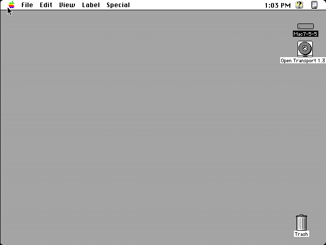

# MacIIvi_MiSTer

A **Macintosh IIvi** core for MiSTer — MC68030 @ 15.6672 MHz with the
on-chip PMMU, the VASP system ASIC, an Apple **8•24-class NuBus video card
(mdc824)** as the display, SCSI hard disk **and CD-ROM**, ASC sound, ADB via
the Egret 68HC05, and no FPU (the 68882 socket is empty in the stock
machine).

**It boots.** System 7.5.5 runs to the Finder on the mdc824 card over HDMI,
on real MiSTer hardware. Latest build:
[`releases/MacIIvi_Unstable_20260713.rbf`](releases/).

## What works

- **Boot to the Finder** — 7.5.5 from a SCSI disk, the whole boot sequence
  (happy Mac → "Mac OS" splash → Finder) on the NuBus card's HDMI output.
- **Display on the mdc824 card.** The IIvi has onboard VASP video *and* a
  NuBus card; the OS's boot screen follows whichever port has a monitor. The
  core reports "no onboard monitor," so the ROM routes the entire display to
  the card — which is what MiSTer scans out to HDMI. (This is why an earlier
  build showed only a gray card: the OS was painting an *onboard* framebuffer
  MiSTer wasn't scanning.)
- **SCSI hard disks** on IDs 0 (boot) and 1 — mount `.img`/`.vhd`/`.hda`.
- **CD-ROM** (Apple CD-ROM drive, SCSI ID 3) — mount a data `.iso`/`.toast`;
  it appears on the desktop as a CD volume. Read-only; CD audio not yet.
- **ASC sound**, **ADB keyboard + mouse** (Egret 341S0851), PRAM save/restore.

## Using it

Copy to your MiSTer SD card:

| From | To |
|---|---|
| `releases/MacIIvi_Unstable_YYYYMMDD.rbf` | `/media/fat/_Unstable/MacIIvi.rbf` (or `_Computer/`) |
| `releases/boot0.rom` | `/media/fat/games/MacIIvi/boot0.rom` |
| `releases/MacIIvi.nvr` | `/media/fat/games/MacIIvi/MacIIvi.nvr` (initial PRAM) |

Put a bootable 7.x disk image in `/media/fat/games/MacIIvi/`, then in the
core's OSD **Mount SCSI-0** and **Reset & Apply**. To use a CD, **Mount
CD-ROM** (SCSI-3) with a data ISO.

**OSD options:** Memory (8 MB default / 20 MB), Monitor size, Aspect/Scale,
Mount SCSI-0/1, Mount CD-ROM, CD-ROM Drive (enable/disable), Mount PRAM,
Reset PRAM & Core, Reset & Apply.

## Building

- **FPGA (Quartus 17.0.2 Lite):** `bash scripts/build.sh` (git-bash) →
  `output_files/MacIIvi.rbf`. Fits an MiSTer DE10-Nano at ~85% ALM /
  543-of-553 M10K (the mdc824 card's 384 KB framebuffer + 32 KB declaration
  ROM dominate block RAM — see [CLAUDE.md](CLAUDE.md)).
- **Verilator sim (primary dev loop, runs in WSL):** see
  [CLAUDE.md](CLAUDE.md) — `cd verilator && make`, then `./obj_dir/Vemu
  --headless --heartbeat --scsi0 <copy.hda> --screenshot <frames>`.

## How it's built

Lineage: the chipset/framework is the **MacLCII core imported at commit
`a254a02`**, retargeted V8→VASP per MAME ([docs/VASP_RETARGET.md](docs/VASP_RETARGET.md)).
The NuBus/mdc824 RTL comes from the Mac II core. The CPU
(`rtl/tg68k/`, TG68KdotC + 68030/PMMU) stays **byte-identical to
`../MacLCII_MiSTer`** at the pinned commit — CPU fixes land there first, then
sync here (see [CLAUDE.md](CLAUDE.md)).

- `MacIIvi.sv` — MiSTer top: clocks, OSD, bus glue, SDRAM, video/SCSI wiring
- `rtl/addrController_top.v`, `rtl/addrDecoder.v` — bus cycles + VASP address map
- `rtl/dataController_top.sv` — IPL, VIA1, Egret, SWIM, SCC, NCR5380 SCSI
- `rtl/pseudovia.sv` — VASP VIA2-equivalent (slot IRQs, monitor sense)
- `rtl/nubus/nubus_video_mdc824.sv` — the NuBus display card (the scanout)
- `rtl/scsi.v`, `rtl/ncr5380.sv` — SCSI target(s): disks + the Apple CD-ROM
- `rtl/asc.sv` — sound; `rtl/egret/` — the 68HC05 ADB/RTC controller

## Verification heritage

The core was brought up against the **MAME `maciivi` running binary as the
oracle of record** (not its source or datasheets) — eight distinct "sad Mac"
causes were each a register/handshake answering with the wrong value or
timing, found by diffing the RTL's behaviour against MAME. The CPU/PMMU
foundation is silicon-adjudicated on a real Macintosh IIcx (68030) and an
030 Amiga:

- `SingleStepTests/` — CPU corpus (721 rows) + PMMU corpus (40 rows),
  MAME-captured and real-silicon-corrected, with Verilator benches
  ([README](SingleStepTests/README.md)). Master plan:
  [68030_PMMU_TESTBENCH.md](68030_PMMU_TESTBENCH.md).
- `verilator/mame/` — the MAME `maciivi` oracle kit (slot-walk goldens,
  register taps, PC/PRAM capture) used throughout the bring-up.

## Status & known limitations

- **Working:** boot to Finder on the card, SCSI disk + CD-ROM, sound, ADB.
- Mouse motion *during* the boot animation can wedge a QuickDraw fill (a
  latent ROM-interaction bug; fine once booted). Onboard-video scanout, the
  Performa 600 personality (32 MHz), 36/68 MB RAM, and CD audio are deferred.
- This is an **Unstable** development core. Report issues with the exact RBF
  date and a photo/screenshot of the screen.
